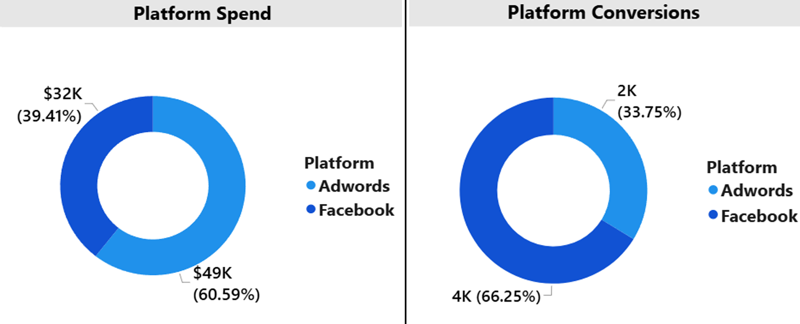
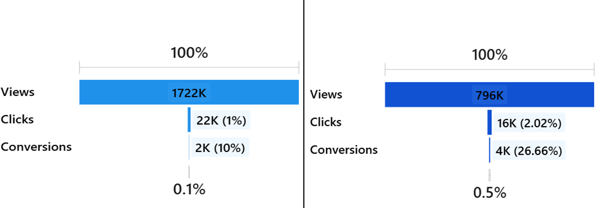
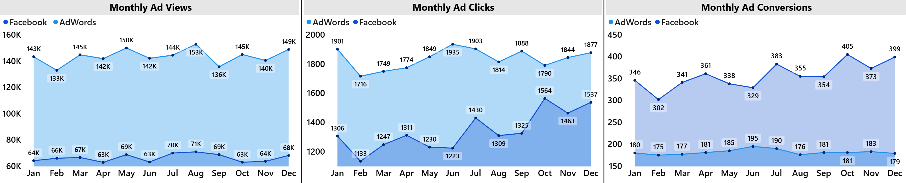
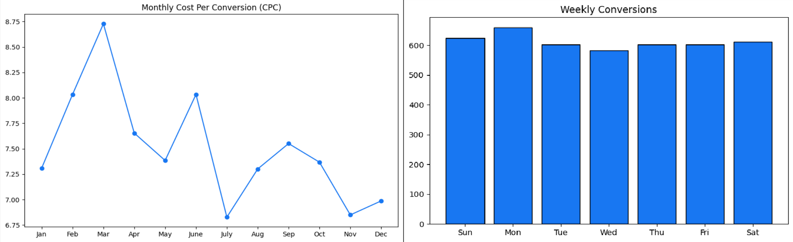

# Marketing Campaign — A/B Testing & Predictive Analysis

## Report & Dashboard

* **Interactive Live Dashboard:** [Explore the Live Power BI Dashboard](https://app.powerbi.com/view?r=eyJrIjoiZGY2NjY1NGMtNDdlZC00N2FlLWIwOTAtZWY1NzEyMWRlMDk5IiwidCI6IjUzYTg5ZjhiLTY2ZmItNDkzOC05NzM5LTZkMjg4MjIwNWUyMyJ9) 
* **Complete Documentation:** [Full Executive Analysis Report](Report.pdf)

## 1. Project Overview

### Interactive Dashboard Demonstration

### Business Problem

As a marketing agency, our primary objective is to maximize the return on investment (ROI) for our clients' advertising campaigns. Having recently executed parallel campaigns on Facebook and Google Ads, we now need to determine which platform yields superior performance across key metrics — clicks, conversions, and cost-effectiveness — to optimize resource allocation and deliver maximum value for our clients.

* **Primary Research Question:** Which advertising platform is better overall—driving higher performance in terms of clicks, conversions, and cost-effectiveness?
---

## 2. Key Findings & Insights

### Platform Budget Allocation vs. Performance Output

* **The Strategic Discrepancy:** Facebook decisively won the A/B test, capturing **66.25% of all conversions (4K)** while consuming less than **40% ($32K) of the budget**. It delivered a **5x higher overall funnel efficiency** compared to Google AdWords, which heavily underperformed despite swallowing the majority of the allocation ($49K).

### Campaign Funnel Breakdown

* **Funnel Friction Zones:** Google AdWords generated massive exposure (**2M views**) and (**22K clicks**) with a **10% click-to-conversion rate**. Conversely, Facebook demonstrated superior audience engagement with a (**769K views & 16K clicks**) with a **2.02% CTR** and an elite **26.66% click-to-conversion rate**.

### Cost & Efficiency Trends

* **Sustained Q4 Optimization:** Facebook conversions demonstrated incredible stability, peaking on **Mondays (~660 conversions)**. Monthly tracking shows that while individual acquisition costs peaked in **March (~$8.73 CPC)**, long-term optimizations successfully drove costs down to highly profitable baselines in **July (~$6.83 CPC)** and **November (~$6.85 CPC)**, matching an annual conversion volume surge in **October**.

---

## 3. Strategic Recommendations

* **Budget Reallocation:** Invert the funding structure by transferring **40% of the AdWords budget ($19.6K)** directly into Facebook. This optimization expands standalone Facebook conversions by **61.25% (+2,450 conversions)** and grows total cross-platform conversions by **27.5% at zero additional cost**.
* **Predictive Scaling:** Deploy the linear regression model ($r = 0.87$) to scale Facebook traffic safely to a daily baseline target of **80 clicks**, which predictably forecasts and secures **19.31 daily conversions** with minimal risk.
* **Chronological Bid Optimization:** Restructure the annual budget to favor the high-efficiency second half of the year (specifically July, November, and October peaks) while pulling back during high-cost windows like March. Apply automated day-of-week bid multipliers to favor **Sundays and Mondays**.
* **Pivot AdWords to Inbound Intent:** Do not abandon Google Ads entirely; instead, combine both platforms into a unified funnel. Transition AdWords away from broad view-generation to capture the passive brand awareness built by Facebook later, restricting its scope strictly to **high-purchase-intent, exact-match keywords** while auditing the landing page to repair mid-funnel drop-offs.
In short - Use Facebook ads to market product or service and Adwords for targeting users who are actively searching for the product or service for an immediate solution they are facing problem with.

---

## 4. Methodology

To deliver institutional-grade certainty, the dataset was processed through a rigorous multi-stage analytics pipeline:

1. **Exploratory Data Analysis (EDA):** Visualized conversion distributions per tier and tracked spending patterns via bubble charts to establish channel linearity and predictability.
2. **A/B Testing & Funnel Profiling:** Chronologically mapped views, clicks, and conversion volumes weekly and monthly for both campaigns to isolate high-efficiency performance windows.
3. **Statistical Analysis (Hypothesis Testing):** Deployed a Welch's T-Test to evaluate whether the difference in daily conversion averages between the platforms was statistically significant. The resulting T-statistic of **32.88** and an explicit $p$-value of **$9.35 \times 10^{-134}$** completely rejected the null hypothesis. The number of conversions from Facebook is greater than the
number of conversions from AdWords. 
4. **Predictive Analysis & Time-Series Cointegration:** Deployed cointegration models to check for stable, long-term equilibrium between spend and conversions, yielding a score of **-14.76** ($p$-value of **$2.13 \times 10^{-26}$**). This was paired with linear regression modeling ($r = 0.87$) to establish a dependable conversion model that maps specific click traffic thresholds directly to expected conversion volume outcomes.
5. **Marketing Analytics:** Traffic Funnel Optimization (CTR, CPC, Conversion Rates), Client ROI Maximization, and Channel Attribution Strategy.

---

## 5. Skills Demonstrated

* **Python :** EDA & answered business questions - Pandas, Matplotlib, Seaborn, Plotly, Numpy, Writing functions, building a product funnel, statistics
* **Power BI :** Dashboard - Dax, ETL, calculated columns, data visualization, data modeling

---
## 6. Repo Structure

├── dashboard/
│   └── Marketing Campaign.pbix
├── Dataset/
│   └── marketing_campaign_csv
├── EDA/
│   ├── EDA.ipynb
│   └── readme_images/
│       └── images used in readme.md
├── README.md
└── Report.pdf